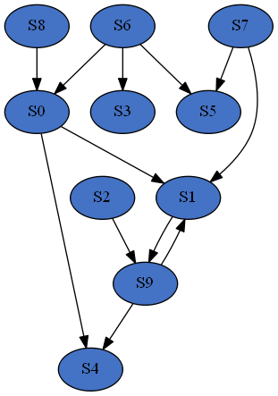
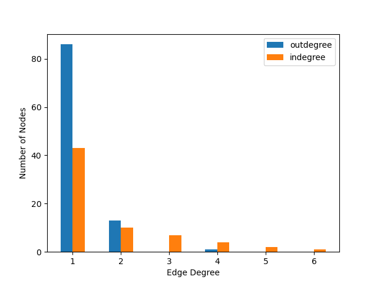
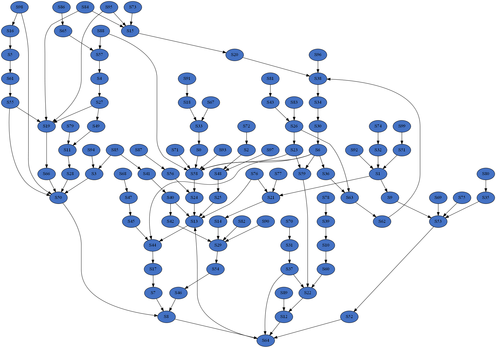

Quick Start
===========

Installation
------------

Supported versions of Python are 3.7, 3.8, and 3.9. Python dependencies include numpy, scipy, antimony, matplotlib,
and pydot. An additional dependency for pydot is either a system installation of Graphviz or pydot installation
via conda.

SBbadger can be installed using pip:

.. code-block:: console

   $ pip install SBbadger
   

Simple Example
--------------

In the simplest possible case SBbadger can generate a single, 10 species, 
random network using the following commands in the python interpreter:

.. code-block:: console

   >>> from SBbadger import generate
   >>> generate.models()

In this case, SBbadger will randomly select reactions from 4 possible reaction types
and randomly select the reactants and products for those reactions from the 10 species.
The possible reaction types are:

===============   =======================   ================
Reaction Type     Default Probabilities     Examples
===============   =======================   ================
UNI-UNI           0.35                      A -> B
BI-UNI            0.3                       A + B -> C
UNI-BI            0.3                       A -> B + C
BI-BI             0.05                      A + B -> C + D
===============   =======================   ================

The default reaction probabilities are adjustable. Also note that the same species can be
chosen more than once in a reaction, for example A + A -> B is a valid reaction. Reactions 
will continue to be added to the network until all 10 species have included. Below is the 
depiction of a sample network and an Antimony string describing the associated model:

.. code-block::

    var S0, S1, S9
    ext S2, S3, S4, S5, S6, S7, S8

    J0: S8 -> S0; kc0*S8
    J1: S6 -> S5 + S0; kc1*S6
    J2: S2 + S1 -> S9; kc2*S2*S1
    J3: S7 -> S1 + S5; kc3*S7
    J4: S9 + S0 -> S1 + S4; kc4*S9*S0
    J5: S6 -> S3; kc5*S6

    kc0 = 0.10285116762815472
    kc1 = 65.21087405102236
    kc2 = 34.220083386257116
    kc3 = 11.526991028714853
    kc4 = 0.15553486234310213
    kc5 = 4.977089372937806

    S2 = 4.759074353180305
    S3 = 1.666194306431944
    S4 = 7.110932299198714
    S5 = 6.803821600602985
    S6 = 9.329699040726386
    S7 = 7.7760175494627735
    S8 = 9.74931761300573

    S0 = 3.431293190721635
    S1 = 5.5106455586766545
    S9 = 7.631625970757748
	
``var`` and ``ext`` denote floating and boundary species respectively. The default 
rate law is mass action with all parameters randomly selected from a log-uniform 
distribution with a range from 0.001 to 100. Initial conditions are randomly selected
from a uniform distribution with a range from 0 to 10. By default, the reactions are
irreversible.

Expanded Example
----------------

Now suppose we want to create many models, and with more defined properties. The following python
script will do just that.

.. code-block::

    from SBbadger import generate
    from scipy.stats import zipf

    def in_dist(k):
        return k ** (-2)

    def out_dist(k):
        return zipf.pmf(k, 3)

    if __name__ == "__main__":

        generate.models(
			group_name="extended_example",
			n_models=10,
			n_species=100,
			in_dist=in_dist,
			out_dist=out_dist,
			min_freq=1.0,
			n_cpus=4
			)
			
Two distribution functions are defined, ``in_dist`` and ``out_dist``, for the in-edge and out-edge distributions respectively where ``k`` is the degree. Both are power law functions. SBbadger will discretize, truncate, and renormalize these functions.
Note that ``in_dist`` is defined explicitly but ``out_dist`` is a wrapper around the Scipy function ``zipf``. A short description of the other parameters follows:

* ``group_name``: prepended to all files and the name of the directory where those files will be deposited. 
* ``n_models``: The number of models to be produced.
* ``n_species``: The number of nodes/species per model.
* ``min_freq``: The minimum expected frequency of nodes in every bin. This parameter, along with the number of species, is used to determine where to truncate the distribution.
* ``n_cpus``: The number of cores to run in parallel. Note that ``if __name__ == "__main__":`` is necessary to use multiprocessing on Windows.

In the above example 10 models will be produced, each with 100 species; the in-edge and out-edge distributions will both follow a power law but with different exponents; the distributions will be truncated such that every degree bin will have a minimum expected node count of 1; and the models will be split into 4 groups to be processed in parallel. Below are examples of the resulting distributions and a network.

Additional examples can be found on the :doc:`usage` page, and detailed information regarding the methods can be found on the :doc:`methods` page.