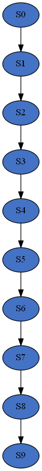
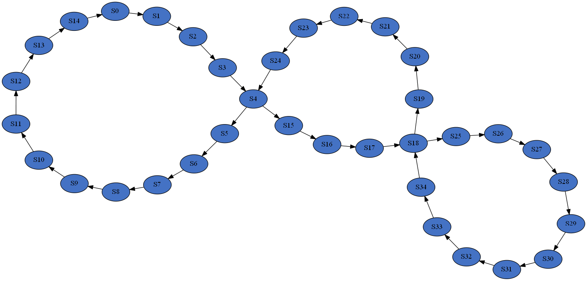
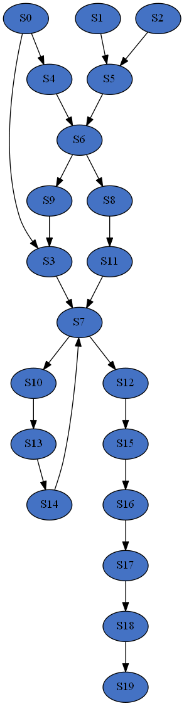

Usage
=====

There are three steps to model generation with SBbadger: generation of frequency distributions, network construction,
and imposition of rate laws. For greater flexibility these steps can be executed individually. The ``generate.models``
function effectively strings these modules together so the arguments for each of these components translates directly
to the generation of models. The outputs of the modules are likewise also generated by ``generate.models``.

Generating distributions
------------------------

To generate distributions we call the ``generate.distributions`` function from SBbadger.  There are two options for
generating degree frequency distributions. The first is to supply a function.

.. code-block:: console

    import SBbadger

    def in_dist(k):
        return k ** (-2)

    SBbadger.generate.distributions(
        group_name="test",
        n_models=10,
        n_species=50,
        in_dist=in_dist,
        min_freq=1.0
        )

``in_dist(k)`` is an un-normalized continuous power law function that is handed to SBbadger and subsequently
discretized, truncated, and normalized. Truncation and normalization depend on the number of species (``n_species``)
and the minimum expected number of nodes per degree (``min_freq``). Here , for example, we have ``min_freq=1.0``,
meaning that the expected number of nodes with degree X must be greater than 1. For the above example we obtain
degree probabilities and expected frequencies found in the following table.

.. list-table::
   :widths: 20, 5, 5, 5, 5, 5

   * - Edge Degree
     - 1
     - 2
     - 3
     - 4
     - 5
   * - Probabilities
     - 0.683
     - 0.171
     - 0.076
     - 0.043
     - 0.027
   * - Expected Frequencies
     - 34.162
     - 8.541
     - 3.796
     - 2.135
     - 1.366

If an edge degree of 6 were allowed the probability mass would be redistributed and the degree 6 bin would
have an expected node frequency less than the cutoff of 1.Once the probability distribution is determined it
is sampled up to the number of desired species and an output file is deposited into the ``distributions``
directory. For the above example a sample looks like the following:

.. code-block:: console

    out distribution

    in distribution
    1,34
    2,10
    3,4
    4,1
    5,1

    joint distribution

Note that this example only results in an in-degree sampling as there is no out-degree or joint-degree functions
provided.

The second way to generate a frequency sampling is to directly provide a probability list. This takes the form
*[(degree_1, prob_1), (degree_2, prob_2), ... (degree_n, prob_n)]* such as

.. code-block:: console

    in_dist = [(1, 0.6), (2, 0.3), (3, 0.1)]

A third option is to simply provide the frequency distribution directly. This takes the form
*[(degree_1, freq_1), (degree_2, freq_2), ... (degree_n, freq_n)]* such as

.. code-block:: console

    in_dist = [(1, 6), (2, 3), (3, 1)]

Note that in this last case, if 10 models are desired SBbadger will produce 10 output files with the exact same
frequency distributions. Currently this is necessary to produce the same number of networks in the next step.

Although the absence of one of the distributions is valid, mixing methods is not. Providing a function for the indegree
distribution and a list for the outdegree distribution is not currently supported.

One additional argument available to all generation functions is ``n_cpus``, which controls how many cpus are used.
If ``n_cpus`` is greater than 1 then the models will be evenly split among them.

Generating Networks
-------------------

The ``generate.networks`` function reads the output of the ``generate.distributions`` function and constructs
reaction networks based on any distributions it finds, or randomly if it finds none. In the simplest case one just
calls the function with the ``group_name`` argument as shown here:

.. code-block:: console

    SBbadger.generate.networks(group_name=<group_name>)

An example of the output, using the ``in_dist`` example above the result is a set of files that look like the following:

.. code-block:: console

    50
    2,(30),(25:46),(),(),()
    1,(17:42),(28),(),(),()
    0,(13),(46),(),(),()
    1,(31:27),(34),(),(),()
    0,(22),(45),(),(),()
    2,(27),(12:9),(),(),()
    3,(46:9),(49:13),(),(),()
    0,(45),(36),(),(),()
    1,(8:9),(8),(),(),()
    0,(40),(12),(),(),()
    2,(17),(39:25),(),(),()
    0,(0),(34),(),(),()
    2,(19),(2:27),(),(),()
    1,(3:1),(30),(),(),()
    2,(26),(24:49),(),(),()
    2,(37),(22:0),(),(),()
    2,(3),(17:44),(),(),()
    0,(1),(42),(),(),()
    1,(24:3),(18),(),(),()
    0,(23),(11),(),(),()
    0,(28),(38),(),(),()
    2,(22),(32:35),(),(),()
    0,(30),(27),(),(),()
    0,(15),(7),(),(),()
    0,(4),(16),(),(),()
    1,(39:35),(26),(),(),()
    0,(23),(20),(),(),()
    1,(49:35),(1),(),(),()
    0,(24),(0),(),(),()
    2,(12),(47:31),(),(),()
    1,(34:4),(1),(),(),()
    1,(2:3),(6),(),(),()
    1,(12:10),(34),(),(),()
    0,(10),(19),(),(),()
    0,(48),(41),(),(),()
    2,(34),(4:33),(),(),()
    2,(45),(37:12),(),(),()
    2,(28),(10:23),(),(),()
    2,(24),(43:48),(),(),()
    2,(5),(5:21),(),(),()
    2,(10),(29:15),(),(),()
    2,(13),(40:35),(),(),()
    0,(10),(14),(),(),()
    2,(29),(28:3),(),(),()
    0,(48),(46),(),(),()

The first is the number of species in the network. The subsequent lines represent the reactions. The reactions are
formatted as

reaction type, (reactants), (products), (modifiers), (activator/inhibitor), (modifier type).

The reactant types are designated as UNI-UNI: 0, BI_UNI: 1, UNI-BI: 2, and BI-BI: 3. The last three entries are for
modifiers that are available when using modular kinetics. They describe the modifying species, their role as activator
or inhibitor, and the type (allosteric or specific, please see **supplementary material** for more information). The
additional argument ``mod_reg`` is needed to incorporate regulators. An example is thus

.. code-block:: console

    generate.networks(
        group_name=<group_name>,
        mod_reg=[[0.25, 0.25, 0.25, 0.25], 0.5, 0.5],
        )

The ``mod_reg`` argument has three parts: a list of probabilities for finding 0, 1, 2, or 3 modifiers, the probability
that a modifier is an activator (as opposed to an inhibitor), and the probability that it is an allosteric
regulator (as opposed to specific). An example of the output is

.. code-block:: console

    50
    1,(34:25),(38),(47:0),(1:1),(a:s)
    0,(28),(4),(18:4),(-1:1),(a:a)
    2,(24),(32:45),(9:28),(1:-1),(a:a)
    1,(24:41),(43),(43),(1),(s)
    0,(46),(1),(16:9),(1:-1),(s:s)
    0,(43),(31),(),(),()
    3,(8:45),(46:35),(),(),()
    2,(19),(40:41),(20),(1),(s)
    0,(20),(47),(),(),()
    0,(11),(17),(),(),()
    0,(10),(42),(11),(1),(s)
    1,(18:31),(7),(),(),()
    0,(27),(4),(),(),()
    0,(2),(29),(),(),()
    1,(22:17),(21),(),(),()
    0,(32),(5),(),(),()
    2,(4),(9:22),(),(),()
    0,(20),(14),(40),(-1),(s)
    0,(15),(30),(),(),()
    2,(48),(38:49),(),(),()
    2,(33),(36:0),(),(),()
    2,(16),(20:44),(),(),()
    0,(46),(11),(),(),()
    2,(25),(10:28),(),(),()
    2,(8),(8:6),(),(),()
    0,(7),(48),(),(),()
    0,(2),(33),(),(),()
    0,(9),(3),(),(),()
    0,(25),(37),(),(),()
    2,(1),(2:27),(),(),()
    0,(30),(15),(),(),()
    2,(26),(24:26),(),(),()
    0,(24),(34),(),(),()
    2,(39),(31:19),(),(),()
    2,(36),(39:16),(),(),()
    2,(1),(23:12),(),(),()
    2,(37),(17:13),(),(),()
    2,(2),(18:25),(),(),()

As many as three modifiers are currently supported. Note that the modifiers tend to stop getting added as the
algorithm progresses. This is because modifiers count against the edge distributions and this power law distribution
has relatively few high edge nodes. Thus, it becomes less and less likely that nodes will have enough edges to
support additional modifiers.

Two additional options are available at this stage. The first is an option to eliminate reactions that appear to violate
mass balance, such as ``A + B -> A``. This is done with the argument ``mass_violating_reactions=False``. The second
is to limit how edges are counted against the distributions to only those with reactants and products that are consumed
and produced respectively. Thus, in the reaction A + B -> A + C, only B -> C would be added to the edge network. Note
that the full reaction would still be added to the model. This is done to better simulate metabolic networks and is
enabled by the argument ``edge_type="metabolic"``.

Addition of Rate-Laws
---------------------

The ``generate.rate_laws`` function reads the output of the ``generate.networks`` function and imposes rate-laws on the
reactions. In the simplest case one can just call

.. code-block:: console

    SBbadger.generate.rate_laws(group_name=<group_name>)

This will default to mass action kinetics which is equivalent to including argument

.. code-block:: console

    kinetics=['mass_action', 'loguniform', ['kf', 'kr', 'kc'], [[0.01, 100], [0.01, 100], [0.01, 100]]]

In the mass-action case, ``kf`` and ``kr`` are forward and reverse rates for reversible reactions and ``kc`` is the
rate for non-reversible reactions. The probability  that a reaction is reversibility can be dictated with the argument
``rev_prob=<prob>`` where ``<prob>`` is the probability that a reaction is reversible. Currently, only the forward
reactions are considered when counting edges and building the network (previous step). Future versions will
incorporate the reverse reactions as well.

Three other rate raws are available in SBbadger: lin-log, generalized Michaelis-Menten, and modular. Examples of their
respective inclusions as arguments are

.. code-block:: console

    kinetics=['lin_log', 'uniform', ['v', 'hs'], [[0.0, 100], [0.0, 100]]]
    kinetics=['hanekom', 'normal', ['v', 'ks', 'kp', 'keq'], [[1, 1], [1, 1], [1, 1], [1, 1]]]
    kinetics=['modular_CM', 'trivial', ['kf', 'kr', 'km', 'mol']]

Each rate-law has its own set of parameters. Please refer to **supplementary material** for more information on them.
Note that there are four parameter distributions that can be used here including uniform, log-uniform, normal,
log-normal, as well as the non-distribution trivial. The distributions are derived from the python Scipy package. The
uniform and log-uniform distributions require ranges while the normal and log-normal distributions require location
and scale parameters. The *trivial* option simply sets all parameters to 1 for use in parameter calibration testing.
These same ranges can be defined for the species initial conditions using the ``ic_params`` argument. An example of
this is

.. code-block:: console

    ic_params=['lognormal', exp(1), 1]

The output of the rate-law module is an Antimony string and an SBML model. An example of the Antimony strings for the
network example above with no modifiers and for mass-action rate-laws is given here.

.. code-block:: console

    var S0, S1, S2, S3, S4, S9, S10, S12, S13, S15, S17, S19, S22, S23, S24, S26, S27, S28, S29, S30, S31, S34, S35, S37, S39, S40, S42, S45, S46, S48, S49
    ext S6, S7, S8, S11, S14, S16, S18, S20, S21, S25, S32, S33, S36, S38, S41, S43, S44, S47

    J0: S30 -> S25 + S46; kc0*S30
    J1: S17 + S42 -> S28; kc1*S17*S42
    J2: S13 -> S46; kc2*S13
    J3: S31 + S27 -> S34; kc3*S31*S27
    J4: S22 -> S45; kc4*S22
    J5: S27 -> S12 + S9; kc5*S27
    J6: S46 + S9 -> S49 + S13; kc6*S46*S9
    J7: S45 -> S36; kc7*S45
    J8: S8 + S9 -> S8; kc8*S8*S9
    J9: S40 -> S12; kc9*S40
    J10: S17 -> S39 + S25; kc10*S17
    J11: S0 -> S34; kc11*S0
    J12: S19 -> S2 + S27; kc12*S19
    J13: S3 + S1 -> S30; kc13*S3*S1
    J14: S26 -> S24 + S49; kc14*S26
    J15: S37 -> S22 + S0; kc15*S37
    J16: S3 -> S17 + S44; kc16*S3
    J17: S1 -> S42; kc17*S1
    J18: S24 + S3 -> S18; kc18*S24*S3
    J19: S23 -> S11; kc19*S23
    J20: S28 -> S38; kc20*S28
    J21: S22 -> S32 + S35; kc21*S22
    J22: S30 -> S27; kc22*S30
    J23: S15 -> S7; kc23*S15
    J24: S4 -> S16; kc24*S4
    J25: S39 + S35 -> S26; kc25*S39*S35
    J26: S23 -> S20; kc26*S23
    J27: S49 + S35 -> S1; kc27*S49*S35
    J28: S24 -> S0; kc28*S24
    J29: S12 -> S47 + S31; kc29*S12
    J30: S34 + S4 -> S1; kc30*S34*S4
    J31: S2 + S3 -> S6; kc31*S2*S3
    J32: S12 + S10 -> S34; kc32*S12*S10
    J33: S10 -> S19; kc33*S10
    J34: S48 -> S41; kc34*S48
    J35: S34 -> S4 + S33; kc35*S34
    J36: S45 -> S37 + S12; kc36*S45
    J37: S28 -> S10 + S23; kc37*S28
    J38: S24 -> S43 + S48; kc38*S24
    J39: S5 -> S5 + S21; kc39*S5
    J40: S10 -> S29 + S15; kc40*S10
    J41: S13 -> S40 + S35; kc41*S13
    J42: S10 -> S14; kc42*S10
    J43: S29 -> S28 + S3; kc43*S29
    J44: S48 -> S46; kc44*S48

    kc0 = 95.09231549528418
    kc1 = 21.846000837613712
    kc2 = 0.010207118469979758
    kc3 = 14.53983846916598
    kc4 = 0.3063102589681681
    kc5 = 5.6583504116344105
    kc6 = 11.895989008650211
    kc7 = 0.02342131950114705
    kc8 = 46.791934613303276
    kc9 = 0.368697617922932
    kc10 = 0.9857941574904792
    kc11 = 64.14505922751162
    kc12 = 0.19034140301429042
    kc13 = 16.26778575540663
    kc14 = 50.89760692771075
    kc15 = 38.854375841000554
    kc16 = 0.06274431047448252
    kc17 = 6.946342130464891
    kc18 = 0.018991821423965872
    kc19 = 0.5283260641121719
    kc20 = 0.07724088544899521
    kc21 = 24.817604758983393
    kc22 = 0.043762092745101955
    kc23 = 3.1506530152360264
    kc24 = 8.22224798501388
    kc25 = 32.202613196883675
    kc26 = 1.4186396816198577
    kc27 = 0.604528340218773
    kc28 = 0.06941098965796533
    kc29 = 9.024522655383246
    kc30 = 0.01460079515171155
    kc31 = 70.70154224644348
    kc32 = 8.454278537396494
    kc33 = 0.9286960665008347
    kc34 = 0.01486076721195414
    kc35 = 4.207594702359928
    kc36 = 9.533291721767808
    kc37 = 7.603619399777634
    kc38 = 0.019638339050245604
    kc39 = 0.23520873992372757
    kc40 = 0.2377671048865366
    kc41 = 40.3775495265031
    kc42 = 0.27260410247450073
    kc43 = 0.763332014620716
    kc44 = 0.025955206569857534

    S6 = 1.5925611828887387
    S7 = 6.672708910681932
    S8 = 2.604139993021597
    S11 = 0.33489713017635925
    S14 = 8.24891070193519
    S16 = 3.917476502270385
    S18 = 1.904688234653965
    S20 = 8.01783519166921
    S21 = 3.921426595975077
    S25 = 7.094526992187122
    S32 = 8.504772463337872
    S33 = 3.9415343772245715
    S36 = 6.148834986756054
    S38 = 7.107308366207627
    S41 = 7.650907695464841
    S43 = 7.3772644682573905
    S44 = 8.89562794952677
    S47 = 7.950069713193003

    S0 = 9.326102903043695
    S1 = 0.4786073798354773
    S2 = 9.480608923317586
    S3 = 7.504077528139294
    S4 = 6.173796094887902
    S9 = 3.724622541133983
    S10 = 4.3239107410316215
    S12 = 4.867336290000845
    S13 = 3.8376180953012007
    S15 = 7.346600116870077
    S17 = 2.851070044686045
    S19 = 2.285063942679205
    S22 = 8.234886125497047
    S23 = 6.786365847954274
    S24 = 2.6809150199676424
    S26 = 3.569157269532055
    S27 = 9.360058869538637
    S28 = 0.20375549488103273
    S29 = 6.990677750089848
    S30 = 1.9026230328715354
    S31 = 4.329040326249945
    S34 = 7.286302439936369
    S35 = 0.5967458725667996
    S37 = 3.230515288901772
    S39 = 4.82381425144089
    S40 = 0.2689319883605268
    S42 = 4.104803938831413
    S45 = 8.353734642978685
    S46 = 0.5945646758954759
    S48 = 0.17738308727245355
    S49 = 3.2063045261872802

The modular rate-laws have five different varieties: CM, DM, SM, FM, and PM.The parameter types for each is the same.
More info on them can be found in **supplementary material** and in **Liebermeister**. The addition of modifiers
in the network generation phase is intended solely for the modular rate-laws. Adding one of the other rate-laws to
a network with modifiers will result in erroneous models. An example of the Antimony strings for the
network example above with with modifiers and for modular rate-laws with the CM subtype is given here.

.. code-block:: console

    var S0, S1, S2, S3, S4, S9, S10, S12, S13, S15, S17, S19, S22, S23, S24, S26, S27, S28, S29, S30, S31, S34, S35, S37, S39, S40, S42, S45, S46, S48, S49
    ext S6, S7, S8, S11, S14, S16, S18, S20, S21, S25, S32, S33, S36, S38, S41, S43, S44, S47

    J0: S30 -> S25 + S46; (kf_0*(S30/km_0_30)^m_0_30)/((1 + S30/km_0_30)^m_0_30 - 1)
    J1: S17 + S42 -> S28; (kf_1*(S17/km_1_17)^m_1_17*(S42/km_1_42)^m_1_42)/((1 + S17/km_1_17)^m_1_17*(1 + S42/km_1_42)^m_1_42 - 1)
    J2: S13 -> S46; (kf_2*(S13/km_2_13)^m_2_13)/((1 + S13/km_2_13)^m_2_13 - 1)
    J3: S31 + S27 -> S34; (kf_3*(S31/km_3_31)^m_3_31*(S27/km_3_27)^m_3_27)/((1 + S31/km_3_31)^m_3_31*(1 + S27/km_3_27)^m_3_27 - 1)
    J4: S22 -> S45; (kf_4*(S22/km_4_22)^m_4_22)/((1 + S22/km_4_22)^m_4_22 - 1)
    J5: S27 -> S12 + S9; (kf_5*(S27/km_5_27)^m_5_27)/((1 + S27/km_5_27)^m_5_27 - 1)
    J6: S46 + S9 -> S49 + S13; (kf_6*(S46/km_6_46)^m_6_46*(S9/km_6_9)^m_6_9)/((1 + S46/km_6_46)^m_6_46*(1 + S9/km_6_9)^m_6_9 - 1)
    J7: S45 -> S36; (kf_7*(S45/km_7_45)^m_7_45)/((1 + S45/km_7_45)^m_7_45 - 1)
    J8: S8 + S9 -> S8; (kf_8*(S8/km_8_8)^m_8_8*(S9/km_8_9)^m_8_9)/((1 + S8/km_8_8)^m_8_8*(1 + S9/km_8_9)^m_8_9 - 1)
    J9: S40 -> S12; (kf_9*(S40/km_9_40)^m_9_40)/((1 + S40/km_9_40)^m_9_40 - 1)
    J10: S17 -> S39 + S25; (kf_10*(S17/km_10_17)^m_10_17)/((1 + S17/km_10_17)^m_10_17 - 1)
    J11: S0 -> S34; (kf_11*(S0/km_11_0)^m_11_0)/((1 + S0/km_11_0)^m_11_0 - 1)
    J12: S19 -> S2 + S27; (kf_12*(S19/km_12_19)^m_12_19)/((1 + S19/km_12_19)^m_12_19 - 1)
    J13: S3 + S1 -> S30; (kf_13*(S3/km_13_3)^m_13_3*(S1/km_13_1)^m_13_1)/((1 + S3/km_13_3)^m_13_3*(1 + S1/km_13_1)^m_13_1 - 1)
    J14: S26 -> S24 + S49; (kf_14*(S26/km_14_26)^m_14_26)/((1 + S26/km_14_26)^m_14_26 - 1)
    J15: S37 -> S22 + S0; (kf_15*(S37/km_15_37)^m_15_37)/((1 + S37/km_15_37)^m_15_37 - 1)
    J16: S3 -> S17 + S44; (kf_16*(S3/km_16_3)^m_16_3)/((1 + S3/km_16_3)^m_16_3 - 1)
    J17: S1 -> S42; (kf_17*(S1/km_17_1)^m_17_1)/((1 + S1/km_17_1)^m_17_1 - 1)
    J18: S24 + S3 -> S18; (kf_18*(S24/km_18_24)^m_18_24*(S3/km_18_3)^m_18_3)/((1 + S24/km_18_24)^m_18_24*(1 + S3/km_18_3)^m_18_3 - 1)
    J19: S23 -> S11; (kf_19*(S23/km_19_23)^m_19_23)/((1 + S23/km_19_23)^m_19_23 - 1)
    J20: S28 -> S38; (kf_20*(S28/km_20_28)^m_20_28)/((1 + S28/km_20_28)^m_20_28 - 1)
    J21: S22 -> S32 + S35; (kf_21*(S22/km_21_22)^m_21_22)/((1 + S22/km_21_22)^m_21_22 - 1)
    J22: S30 -> S27; (kf_22*(S30/km_22_30)^m_22_30)/((1 + S30/km_22_30)^m_22_30 - 1)
    J23: S15 -> S7; (kf_23*(S15/km_23_15)^m_23_15)/((1 + S15/km_23_15)^m_23_15 - 1)
    J24: S4 -> S16; (kf_24*(S4/km_24_4)^m_24_4)/((1 + S4/km_24_4)^m_24_4 - 1)
    J25: S39 + S35 -> S26; (kf_25*(S39/km_25_39)^m_25_39*(S35/km_25_35)^m_25_35)/((1 + S39/km_25_39)^m_25_39*(1 + S35/km_25_35)^m_25_35 - 1)
    J26: S23 -> S20; (kf_26*(S23/km_26_23)^m_26_23)/((1 + S23/km_26_23)^m_26_23 - 1)
    J27: S49 + S35 -> S1; (kf_27*(S49/km_27_49)^m_27_49*(S35/km_27_35)^m_27_35)/((1 + S49/km_27_49)^m_27_49*(1 + S35/km_27_35)^m_27_35 - 1)
    J28: S24 -> S0; (kf_28*(S24/km_28_24)^m_28_24)/((1 + S24/km_28_24)^m_28_24 - 1)
    J29: S12 -> S47 + S31; (kf_29*(S12/km_29_12)^m_29_12)/((1 + S12/km_29_12)^m_29_12 - 1)
    J30: S34 + S4 -> S1; (kf_30*(S34/km_30_34)^m_30_34*(S4/km_30_4)^m_30_4)/((1 + S34/km_30_34)^m_30_34*(1 + S4/km_30_4)^m_30_4 - 1)
    J31: S2 + S3 -> S6; (kf_31*(S2/km_31_2)^m_31_2*(S3/km_31_3)^m_31_3)/((1 + S2/km_31_2)^m_31_2*(1 + S3/km_31_3)^m_31_3 - 1)
    J32: S12 + S10 -> S34; (kf_32*(S12/km_32_12)^m_32_12*(S10/km_32_10)^m_32_10)/((1 + S12/km_32_12)^m_32_12*(1 + S10/km_32_10)^m_32_10 - 1)
    J33: S10 -> S19; (kf_33*(S10/km_33_10)^m_33_10)/((1 + S10/km_33_10)^m_33_10 - 1)
    J34: S48 -> S41; (kf_34*(S48/km_34_48)^m_34_48)/((1 + S48/km_34_48)^m_34_48 - 1)
    J35: S34 -> S4 + S33; (kf_35*(S34/km_35_34)^m_35_34)/((1 + S34/km_35_34)^m_35_34 - 1)
    J36: S45 -> S37 + S12; (kf_36*(S45/km_36_45)^m_36_45)/((1 + S45/km_36_45)^m_36_45 - 1)
    J37: S28 -> S10 + S23; (kf_37*(S28/km_37_28)^m_37_28)/((1 + S28/km_37_28)^m_37_28 - 1)
    J38: S24 -> S43 + S48; (kf_38*(S24/km_38_24)^m_38_24)/((1 + S24/km_38_24)^m_38_24 - 1)
    J39: S5 -> S5 + S21; (kf_39*(S5/km_39_5)^m_39_5)/((1 + S5/km_39_5)^m_39_5 - 1)
    J40: S10 -> S29 + S15; (kf_40*(S10/km_40_10)^m_40_10)/((1 + S10/km_40_10)^m_40_10 - 1)
    J41: S13 -> S40 + S35; (kf_41*(S13/km_41_13)^m_41_13)/((1 + S13/km_41_13)^m_41_13 - 1)
    J42: S10 -> S14; (kf_42*(S10/km_42_10)^m_42_10)/((1 + S10/km_42_10)^m_42_10 - 1)
    J43: S29 -> S28 + S3; (kf_43*(S29/km_43_29)^m_43_29)/((1 + S29/km_43_29)^m_43_29 - 1)
    J44: S48 -> S46; (kf_44*(S48/km_44_48)^m_44_48)/((1 + S48/km_44_48)^m_44_48 - 1)

    kf_0 = 0.16423145042897022
    kf_1 = 10.574418831787524
    kf_10 = 0.7950835761650228
    kf_11 = 0.02161528045231101
    kf_12 = 0.06649551996038168
    kf_13 = 0.0441285549530707
    kf_14 = 0.03514490306494845
    kf_15 = 2.871919621594715
    kf_16 = 0.15243191300383818
    kf_17 = 0.3265603882514614
    kf_18 = 0.04240526656422484
    kf_19 = 0.013689791463492586
    kf_2 = 0.06635671634339946
    kf_20 = 0.014069400349805248
    kf_21 = 0.025927844020957897
    kf_22 = 0.12042357793875474
    kf_23 = 73.56920181063715
    kf_24 = 51.473572690528044
    kf_25 = 1.546678924165623
    kf_26 = 6.3056247196571915
    kf_27 = 5.635152640386222
    kf_28 = 0.1525733986000751
    kf_29 = 0.2586258844732475
    kf_3 = 0.9349022365488929
    kf_30 = 0.1924363710855219
    kf_31 = 7.310072545682451
    kf_32 = 0.01757415391816569
    kf_33 = 8.600776074327875
    kf_34 = 3.006285736921638
    kf_35 = 13.099980205800625
    kf_36 = 0.7658494807610738
    kf_37 = 0.08022651954547745
    kf_38 = 0.6435792049766685
    kf_39 = 0.0673201947266414
    kf_4 = 0.22683524330359173
    kf_40 = 1.6171164244644465
    kf_41 = 0.03473428377487134
    kf_42 = 27.06941600991096
    kf_43 = 0.029268890407614042
    kf_44 = 14.598051596207293
    kf_5 = 0.018225857461126288
    kf_6 = 7.039175256137345
    kf_7 = 1.525121427175262
    kf_8 = 14.749098391450723
    kf_9 = 0.09740994091464408

    km_0_30 = 0.3384914057097465
    km_10_17 = 33.987501195915605
    km_11_0 = 51.49599574024147
    km_12_19 = 14.75040823559624
    km_13_1 = 14.986932717313744
    km_13_3 = 0.010326220569312294
    km_14_26 = 17.197938645246868
    km_15_37 = 0.2109276492527961
    km_16_3 = 22.985224674060444
    km_17_1 = 0.022364771038655373
    km_18_24 = 0.07525046218867266
    km_18_3 = 0.15303883699776172
    km_19_23 = 9.858323196481745
    km_1_17 = 0.359395159486452
    km_1_42 = 11.808750735377878
    km_20_28 = 0.10285810644345443
    km_21_22 = 0.08728302087206986
    km_22_30 = 1.836815021765405
    km_23_15 = 0.01607275270932248
    km_24_4 = 0.7818870761389392
    km_25_35 = 97.98563332099008
    km_25_39 = 1.1583953207455318
    km_26_23 = 0.06946265706308583
    km_27_35 = 0.06999405496493326
    km_27_49 = 0.29472279691804226
    km_28_24 = 0.012772056338463452
    km_29_12 = 0.054498317188603686
    km_2_13 = 0.9091965181230351
    km_30_34 = 0.17354287794284978
    km_30_4 = 2.443239578570729
    km_31_2 = 0.012963807133438192
    km_31_3 = 0.6042734590526593
    km_32_10 = 0.050719359105094335
    km_32_12 = 0.08635767794855898
    km_33_10 = 94.50469059503256
    km_34_48 = 5.1161229850789995
    km_35_34 = 54.09039083385427
    km_36_45 = 0.07069533235437057
    km_37_28 = 22.83756887718357
    km_38_24 = 0.0277562641884541
    km_39_5 = 3.249446953571174
    km_3_27 = 10.886836366929035
    km_3_31 = 89.6195154119312
    km_40_10 = 10.954080045784327
    km_41_13 = 17.64535880592496
    km_42_10 = 0.07802875521285312
    km_43_29 = 25.140394244475708
    km_44_48 = 1.1982871604150116
    km_4_22 = 3.2202855675436406
    km_5_27 = 44.10547968921076
    km_6_46 = 0.05946287310401042
    km_6_9 = 16.49836209610834
    km_7_45 = 14.766688072438615
    km_8_8 = 2.749113885738995
    km_8_9 = 27.952619134817933
    km_9_40 = 9.742212158281864

    m_0_30 = 0.07835301113857454
    m_10_17 = 0.01844274800539458
    m_11_0 = 3.9826170564026384
    m_12_19 = 0.0867962819415943
    m_13_1 = 0.016952912342878237
    m_13_3 = 66.3513498861971
    m_14_26 = 63.712408816119435
    m_15_37 = 1.9780536574806877
    m_16_3 = 24.025875135990738
    m_17_1 = 0.6258916444869531
    m_18_24 = 0.17163572067790142
    m_18_3 = 0.11852802115986988
    m_19_23 = 0.15851693324594116
    m_1_17 = 0.020790700409010664
    m_1_42 = 0.22257771329310072
    m_20_28 = 21.596583459808752
    m_21_22 = 0.026396910452631223
    m_22_30 = 0.016921499778871283
    m_23_15 = 90.03307941353567
    m_24_4 = 3.856163211330088
    m_25_35 = 0.32660257347450206
    m_25_39 = 2.173782118300039
    m_26_23 = 1.9940533848110849
    m_27_35 = 6.303531888802851
    m_27_49 = 50.03653040110065
    m_28_24 = 0.27916067871688105
    m_29_12 = 11.976805930965932
    m_2_13 = 0.010004869038410785
    m_30_34 = 1.3581913729073036
    m_30_4 = 0.019089017330905268
    m_31_2 = 0.14485216179252716
    m_31_3 = 0.1809695019707465
    m_32_10 = 35.32634975760427
    m_32_12 = 10.988214559504298
    m_33_10 = 47.34667968636848
    m_34_48 = 12.109991167426681
    m_35_34 = 14.116205475805064
    m_36_45 = 0.4552990051172765
    m_37_28 = 2.097470152888202
    m_38_24 = 2.582338119101594
    m_39_5 = 1.1018013313484314
    m_3_27 = 0.24891652693941516
    m_3_31 = 8.589124535828562
    m_40_10 = 3.248308873294955
    m_41_13 = 0.6335756031359031
    m_42_10 = 0.08924282737255076
    m_43_29 = 3.944250116489345
    m_44_48 = 0.010844158362887053
    m_4_22 = 1.1166267631266922
    m_5_27 = 5.840078932834789
    m_6_46 = 69.96790384822188
    m_6_9 = 1.3741760827999046
    m_7_45 = 23.840086303449425
    m_8_8 = 41.444990386119436
    m_8_9 = 0.46292747298589265
    m_9_40 = 0.023714989419376505

    S6 = 7.22770342861695
    S7 = 7.3040909722334195
    S8 = 7.737231554107929
    S11 = 5.232012054987268
    S14 = 0.9540288054850399
    S16 = 2.5398136609073116
    S18 = 3.3081451988388055
    S20 = 0.6802200270360903
    S21 = 6.574773537366951
    S25 = 7.070150045008921
    S32 = 2.123868928204866
    S33 = 8.765883459309338
    S36 = 8.075768950388829
    S38 = 2.4524678490590146
    S41 = 3.643465243377987
    S43 = 1.5987324393044022
    S44 = 8.880836661818348
    S47 = 5.99090962772571

    S0 = 9.87987232975208
    S1 = 5.117681533564472
    S2 = 4.772819867937405
    S3 = 6.605621631918597
    S4 = 4.150275714621511
    S9 = 6.2517561476751435
    S10 = 8.781408351393097
    S12 = 6.04091604540757
    S13 = 6.186034834179516
    S15 = 1.574539995152111
    S17 = 1.8080467851771498
    S19 = 7.930218949244718
    S22 = 8.909178735342142
    S23 = 9.440238073602329
    S24 = 7.507386182827716
    S26 = 0.5017611307651626
    S27 = 3.064961115465694
    S28 = 8.963448520839679
    S29 = 5.718972568890539
    S30 = 5.140809963735403
    S31 = 1.1883543493206417
    S34 = 5.272736732117995
    S35 = 3.902865040264415
    S37 = 9.433194756005042
    S39 = 9.645161809138044
    S40 = 0.16970466760064196
    S42 = 9.864543855995226
    S45 = 2.011220772633473
    S46 = 3.706300073966391
    S48 = 0.748932566175744
    S49 = 8.429267194864355

An additional ``deg`` parameter can be added to any of the rate laws. This has the effect of adding a degradation
reaction for each floating species in the model.

.. code-block:: console

    kinetics=['mass_action', 'loguniform', ['kf', 'kr', 'kc', 'deg], [[0.01, 100], [0.01, 100], [0.01, 100], [0.01, 100]]]

In addition to the output described above, plots for the distributions and network are also generated, but can br
optionally silenced with ``dist_plots=False`` and ``net_plots=False`` arguments. See :doc:`quick_start` for examples.

Standard Networks
-----------------

There are three standard networks that can be generated. These do not make use of degree distributions but instead
make use of specific topological generative algorithms. All three use only UNI-UNI reactions but can be adorned
with any of the available rate-laws.

~~~~~~
Linear
~~~~~~

The simplest of the standard networks is linear and can be called with

.. code-block:: console

    generate.linear()

The default number of species is 10 so the output here looks like

Please see0000 :doc:`methods` for additional options.

~~~~~~
Cyclic
~~~~~~

Cyclic networks can be constructed with

.. code-block:: console

    generate.cyclic(
        n_cycles=3,
        min_species=10,
        max_species=20,)

Three special arguments are available for cyclic models. ``n_cycles`` controls the number of cycles in the network.
``min_species`` and ``max_species`` control the minimum and maximum number of nodes per cycle. The algorithm will
randomly sample from this range. The example below is a network with the above settings.

~~~~~~~~
Branched
~~~~~~~~

Branching networks can be constructed with

    generate.branched(
        seeds=3,
        path_probs=[.1, .8, .1],
        tips=True,
    )

Three special arguments are also available form branched networks. ``seeds`` is the number of starting nodes that
either split in two, grow linearly, or combine with another branch. ``path_probs`` is the probability of each of those
events happening at per iteration. And ``tips=True`` confines those events to the tips of the branches, i.e. the last
nodes in the growing branch(s) if grow or combine are chosen and the second to last node in one of the branches if
split is chosen. The example below is a network with the above settings.

